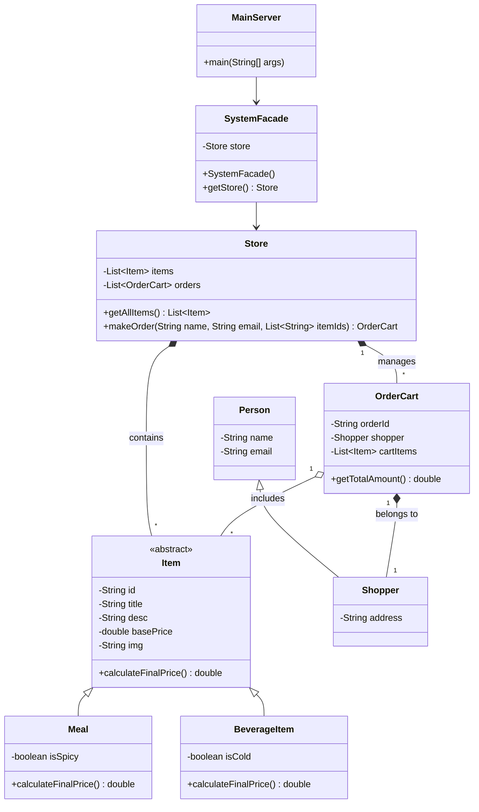
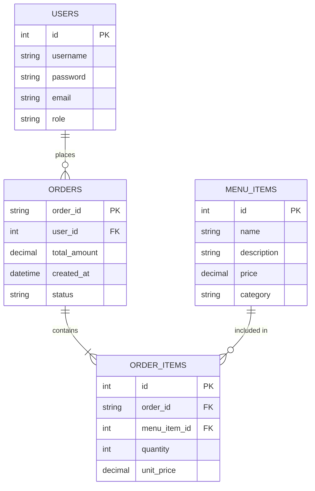

# System Architecture Diagrams

Since image generation is currently unavailable, you can use these exact Mermaid codes in any markdown viewer (like GitHub) or paste them into [Mermaid Live Editor](https://mermaid.live) to get perfect, downloadable `.png` diagrams for your capstone project.

## 1. Class Diagram (`class-diagram.png` equivalent)

## 2. Database ER Diagram (`database-diagram.png` equivalent)

